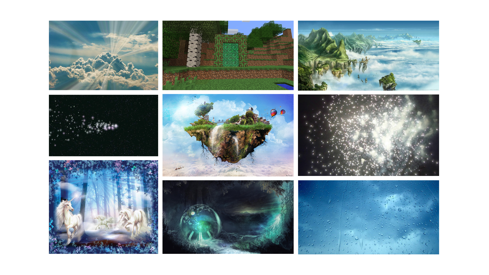

# Cours 14
## Plan de la présentation 3
Durée: 8 à 10 minutes

### Résumer votre projet en une phrase
Nous voulons proposer la création d'une nouvelle dimension pour le jeu __Minecraft__

### Description du projet 
Le jeu __Minecraft__ comprend trois différentes dimensions. L'«_Overworld_» (la dimension normale), le «_Nether_» (une dimension comparable à l'enfer) et l'«_End_» (une dimension qui ne représente quelque chose en précis, mais c'est en principe une gigangteste île dans le vide un peu comme dans l'espace). Nous nous sommes dit, vu que le jeu a une dimension qui ressemble à l'enfer, pourquoi pas faire une dimension qui ressemble au paradis en incluant des nouvelles textures, des effets spéciaux tant visuelle que sonore, des créatures fantastiques, etc...

### Schéma du projet ou scénarimage

### Moodboard
 

### Technologies
Modélisation 3D, Javascript

### Étapes de réalisation
1. Création d'une maquette 2D
2. La transformer en 3D
3. Ajouter de la texture, couleur, lumière, etc...
4. Créer les animations
5. Ajouter les détails de finition
